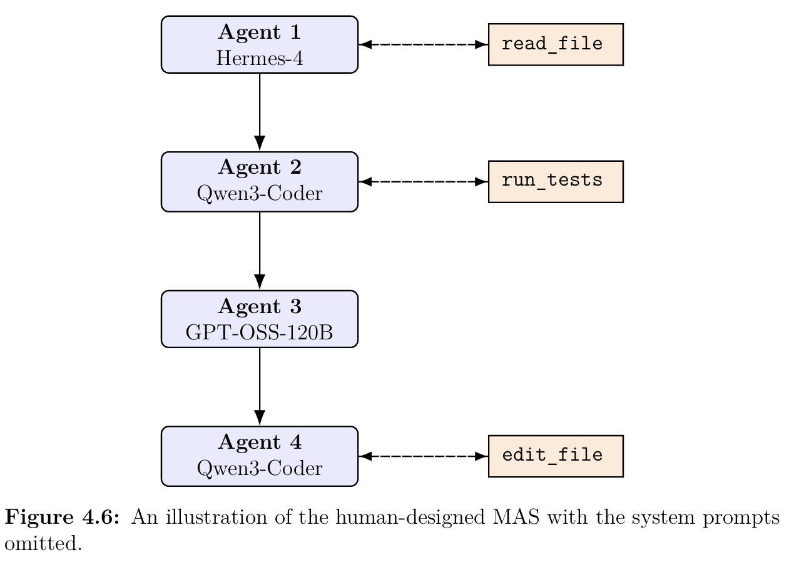
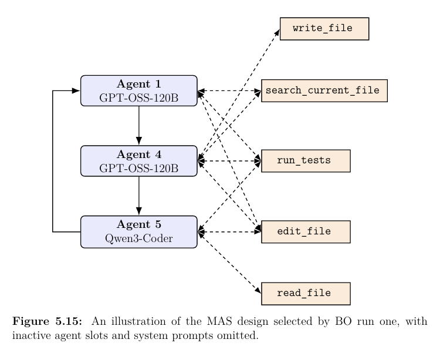

## Agenda

::: { style="height: 80%; display: flex; flex-direction: column; justify-content: center;"}

- **Sprint 1:** the capability, the team, state of the art, benchmark results, other results, risks
- **Sprint 2:** how the field has moved, the menu of seven options, the proposed focus
- **Workshop:** agreeing the goals and activities for Sprint 2

:::

::: {.notes}
~15 min: about 9 min on Sprint 1 and 6 min on Sprint 2, then hand over to the workshop.
:::

# Sprint 1 review {background-color="#0d1720"}

## WP3 at a glance

:::: {.columns}

::: {.column width="44%"}

The capability

Self-evolving agents are autonomous systems that keep optimising their own components through interaction with their environment. They adapt to changing tasks, context and resources while staying safe and getting better.

WP3 looks at what this means for planning, orchestration and execution across use cases.

:::

::: {.column width="6%"}
:::

::: {.column width="50%"}

Core capabilities

<ul class="caps">
  <li class="on">Sprint 1 &#40;1&#41; Communication patterns: blackboard, vertical, horizontal</li>
  <li>&#40;2&#41; Knowledge &amp; memory management</li>
  <li>&#40;3&#41; Reasoning &amp; debate</li>
  <li class="on">Sprint 1 &#40;4&#41; Self-evolving organisation &amp; orchestration (e.g. fault tolerance)</li>
  <li>&#40;5&#41; Long-horizon evaluation: goal drift, bias creep, collapse detection</li>
</ul>
:::

::::

::: {.notes}
Partners agreed to start with a small proof of value in capability (1), with a larger use case along the lines of (4) in mind. When agents must re-organise after a fault or under resource constraints, the orchestration and communication pattern needs a fresh, principled re-assessment.
:::

## Sprint 1 focus: optimising MAS designs

Can the orchestration of a multi-agent system be redesigned automatically? Example: a program-repair MAS (QuixBugs), before and after optimisation.

::: {.before-after}

Before · designed by a human engineer

→

After · selected by Bayesian optimisation

:::

Figures 4.6 and 5.15 from E. Ketabati Augustinsson, <a href="https://www.ai.se/sites/default/files/2026-09/Master_s_Thesis_2026___Edvin_Ketabati.pdf"><em>Master's Thesis</em></a>, 2026.

::: {.notes}
Left: the reference design a human engineer built, a fixed chain of four agents with one tool each. Right: the design the optimiser picked in its first run. It drops an agent, closes the chain into a loop and gives every agent several tools. The optimised designs scored 25–29% better than the human reference (see the benchmark slide). Next slide: how the optimiser works.
:::

## Sprint 1 focus: the FLIWBO loop

AI Sweden, Chalmers and Saab developed FLIWBO, a Bayesian optimisation (BO) framework that iteratively improves how a multi-agent system is orchestrated.

::: {.loop}

<strong>1 · Propose</strong>FLIWBO suggests a design vector of categorical and numerical parameters that fully specify the MAS

→

<strong>2 · Deploy</strong>Your workflow runs the MAS with that configuration

→

<strong>3 · Score</strong>Your evaluation returns one scalar score (costly and noisy)

→

<strong>4 · Learn</strong>FLIWBO updates its model, including the geometry of the input space, and proposes the next design

↺

:::

:::: {.grid2}

::: {.card}

Sprint 1 goals

- Deliver FLIWBO code and documentation to the partners
- Test it and prepare an assessment of the method in an industrial operating context (see *Risks*)
:::

::: {.card .blue}

Who drove it

Led by **Edvin Ketabati Augustinsson**, first as an industrial master's student and then as a summer intern at AI Sweden, preparing the research for adoption.
:::

::::

::: {.notes}
The framework needs two things from a user: a small set of parameters that fully specify a MAS design, and one scalar evaluation of the system. It then iteratively proposes configurations and converges towards a near-optimal design.
:::

## The team

:::: {.grid2}

::: {.card}

AI Sweden (Lindholmen)

Delivered the code, PoV demonstrator, documentation and technical overview

**Edvin Ketabati** // FLIWBO lead (industrial master's thesis, summer intern)  
**Robert A. Bridges** // FLIWBO co-author 
**Mauricio Muñoz** // WP3 lead

:::

::: {.card .blue}

AstraZeneca

Discussions and use-case specifications, test mapping to AZ-internal task

**Gabriele Colcerasa**    
**Anton Husmark**    
**Anders Karlsson**    

:::

::::

:::: {.grid2}

::: {.card .green}

Chalmers

**Yinan Yu**  

:::

::: {.card .orange}

Saab

Sponsored MSc thesis student to do the work. 

**Elias Julin**  

:::

::::

## State of the art: where FLIWBO stands

:::: {.grid3}

::: {.card .green}

BO theory under adaptive models

Ahead. The first cumulative-regret guarantee for <em>learned nonlinear</em> input warps. Any history-dependent selection rule is allowed.

Key rival: LB-GP-UCB (NeurIPS 2024), which handles only an unknown isotropic length scale

:::

::: {.card .orange}

Practical BO toolkits

Unproven. Beats fixed-geometry GP-UCB and escapes a trap that defeats oracle-warp EI. There is no comparison yet with HEBO, SMAC, TPE or vanilla BO with a dimension-scaled prior.

Key rival: HEBO (input + output warping, NeurIPS 2020 BBO winner)

:::

::: {.card .blue}

MAS / agent-design optimisers

Differentiated but thin. The only optimiser with a guarantee in a field of methods that have none. The evidence is one 20-dimensional feasibility study, and it can only select designs within a predefined space.

Rivals: AgentOpt, MALBO, MIPROv2 (fixed space); MaAS, MASS (open-ended)

:::

::::

::: {.takeaway}
**In one line:** FLIWBO leads on guarantees, is untested on raw performance, and fills a real but narrow niche. It is a principled optimiser for a *fixed, expensive, noisy* MAS design space. It complements LLM-driven design generators rather than competing with them.
:::

::: {.notes}
Existing GP-UCB methods carry convergence guarantees only while the kernel (the geometry) is fixed. Prior work covers unknown stationary hyperparameters, misspecification and finite model selection, but none gives high-probability sublinear cumulative regret for data-adaptive nonlinear input warping. Details are in the backup slides.
:::

## Benchmark summary: what the experiments show

:::: {.columns}

::: {.column width="60%"}

::: {.compact-table style="font-size: 1.15em;"}
| Experiment | Result |
|:-----------|:-------|
| Warped synthetic objectives | ✓ Beats raw-coordinate GP-UCB when the geometry is misspecified |
| "Confidence-fence" trap | ✓ Escapes a trap that defeats oracle-warp EI |
| Fashion-MNIST HPO | ✓ Recovers much of the gain from manual log scaling |
| Stationary control (P4) | ✗ Loses where warping is unnecessary |
:::

::: {.takeaway}
Across **four repeated benchmarks**, FLIWBO-UCB has the **best final mean** of all tested deployable methods that carry a matching noise-robust regret guarantee.
:::

:::

::: {.column width="4%"}
:::

::: {.column width="36%"}
 

::: {.card .stat style="font-size: 0.75em;"}

MAS feasibility study

25–29%

better than a human-engineered baseline on a 20-dimensional, costly, noisy program-repair workflow (QuixBugs)

One study against one human reference: it shows feasibility, not superiority over other MAS optimisers

:::

:::

::::

::: {.notes}
Be explicit about the comparison class: methods that admit a matching regret guarantee. Most practical optimisers admit none, and they have not been benchmarked against yet. The results are academic: they are what the paper and repo claim.
:::

## Benchmark summary: best practice for partners

:::: {.grid2}

::: {.card .green}

Reach for BO / FLIWBO when…

- The design space is **fixed and parameterised**: few parameters, bounded if continuous, finite if categorical
- Each evaluation is **expensive and noisy**, e.g. a full MAS run
- You need a search with a **convergence argument** (audit, safety case)
- You run **heterogeneous or smaller-model fleets**, the regime where MAS design still pays off
:::

::: {.card .red}

Look elsewhere when…

- You need structures **outside a predefined design space**: new kinds of operators (parallel branches, voting, debate) or prompts written from scratch. LLM-driven designers (ADAS, AFlow, MaAS) generate these, and FLIWBO can then tune their parameters
- A single agent already solves **more than ~45%** of the task. Adding agents then tends to hurt (Google, 260 configurations)
- The configuration space is **large**. GP-based methods scale poorly, and there is no scaling study yet
:::

::::

::: {.takeaway}
BO is the best-known approach to optimising **expensive black-box** objectives, which is exactly the situation in MAS design. FLIWBO adds formal guarantees while it learns the geometry of the design space.
:::

## Other results from Sprint 1

:::: {.grid2}

::: {.card}

Paper: submitted to AAAI, re-submitted to AISTATS

*No-Regret Bayesian Optimization with Finite-Library Input-Warped Kernels*, Ketabati Augustinsson & Bridges. [arXiv 2609.02993](https://arxiv.org/abs/2609.02993)

The first high-probability sublinear cumulative-regret guarantee for BO that learns nonlinear input transformations from its own history.
:::

::: {.card .blue}

Open-source code

[github.com/edvin-ketabati/FLIWBO](https://github.com/edvin-ketabati/FLIWBO)

`pip install`-able; mixed discrete/continuous design vectors; a **crash-resistant ask/tell loop** that can resume interrupted runs; a QuixBugs MAS example. Research code, not production software.
:::

::: {.card .green}

Partner briefing: SOTA positioning

A competitive positioning of FLIWBO (Appendix A), the wider self-evolving MAS subfield up to September 2026 (Appendix B). Every claim carries a verification tag (full text, abstract only, or second-hand). Together they are the basis for the **seven Sprint 2 options**.
:::

::: {.card .orange}

Partner briefing: Claude Managed Agents

Data-boundary routes, an evaluation checklist and a staged adoption path for partners considering closed-source MAS platforms (Appendix C, in backup).
:::

::::

External signal: a machine referee report (Pith, Sep 2026; not peer review) calls the theory "clean" and the experiments "honest", and flags the dependence on a known RKHS-norm bound as the gap between theory and deployment.

## Identified risks and how to mitigate them

::: {.compact-table style="font-size: 1.12em;"}
| Risk | What we saw | Mitigation |
|:-----|:------------|:-----------|
| **Industrial transfer**  (identified retrospectively) | The partner's agentic system cannot easily be parameterised for FLIWBO. Getting there is significant work, it is not on the roadmap, and the partner is focused on production. **Results remain academic.** | Validate on public benchmarks with ground truth (AgentOpt's 81-combination suite). Check integration readiness *before* committing to partner-dependent deliverables. Steer Sprint 2 by partner pull and towards work that needs no partner data. |
| **Algorithmic** | Warping can hurt when the input geometry is already right: FLIWBO underperforms fixed-kernel GP-UCB on a stationary control | Characterise when to switch warping off, or show that the identity branch recovers quickly |
| **Scope** | Needs compact, low-dimensional configuration spaces (inherited from GPs). There is no scaling study of compute or problem-solving quality | Run a scaling study (dimension, library size) if partners continue on this track |
| **Evidence gap** | No comparison with practical optimisers (HEBO, SMAC, TPE, vanilla BO) or the closest rival (LB-GP-UCB). Only one MAS feasibility study | Add HEBO, vanilla BO and LB-GP-UCB baselines (cheap) and run on the AgentOpt benchmarks |
:::

::: {.notes}
Frame the industrial-transfer risk constructively: the partner was clear that integration isn't on their roadmap and that they don't want the WP to wait for it. That is why the Sprint 2 proposal is driven by where they do see value.
:::

# Sprint 2 proposal October 2026 – April 2027 {background-color="#0d1720"}

## The field has moved

The open question is no longer <em>whether</em> agents can improve themselves. It is whether that improvement can be trusted, kept valid, measured affordably and carried through model changes.

:::: {.grid3}

::: {.card .stat}

44%

of long-memory failures come from an agent acting on an **outdated value**, even though the update is in its context

Fan et al., Aug 2026: staleness, not forgetting

:::

::: {.card .stat}

±13 pp

accuracy swing when a new model reads **free-text notes** written by another. Structured memory: ≈ 0

Goyal & Ray, Sep 2026: memory across model upgrades

:::

::: {.card .stat}

+16 pp

from **expert-curated** skills on average. Skills the agents wrote for themselves: −1.3 pp

SkillsBench, Feb 2026

:::

::: {.card .stat}

99 → 54%

the refusal rate of a coding agent on harmful requests after it began drawing on **its own memory**

Shao et al., ICLR 2026: misevolution

:::

::: {.card .stat}

30% vs 81%

accuracy of agent groups when the needed facts are **split between agents**, against one agent holding them all

HiddenBench, ICML 2026

:::

::: {.card .stat}

~45%

the single-agent solve rate above which **adding agents tends to hurt**

Kim et al. (Google), 260 configurations, 2026

:::

::::

::: {.notes}
Also say: self-improvement is now a product. Anthropic Dreaming, Google Memory Bank, Microsoft procedural memory and AWS episodic memory all turn experience into memory automatically. Research value lies where platforms structurally cannot help: validity against changing artefacts, statistical acceptance guarantees, proprietary rules, portability across vendors, and on-premise operation.
:::

## The menu: seven candidate directions

Selection criteria: industrial relevancefrontier-proofdefensible noveltyfeasible without partner data

::: {.compact-table style="font-size: 1.22em;"}
| # | Option | Core question | WP cap. | Novelty confidence |
|:-:|:--------------|:------------------------------------|:-----:|:--------------|
| 1 | **Knowledge rot** | How does an agent know which of its learned lessons have gone stale? | 2, 5 | Moderate |
| 2 | **Constraint retention** | Do self-evolving systems keep following rules that cost them performance? | 4, 5 | Moderate |
| 3 | **Re-optimising without starting over** | Can we re-optimise a MAS after a model or agent change, and keep the guarantee? | 4 | Potentially high (depends on the proof) |
| 4 | **Value of expert knowledge** | When is expert knowledge worth writing down, and what is the cheapest way to capture it? | 2 | Moderate–high |
| 5 | **Sound "keep or discard" decisions** | Can keep-or-discard decisions on changes be made cheaply and still be statistically sound? | 5 | Low until prior-art check |
| 6 | **Knowledge pooling** | When agents know different things, should they combine it by talking or by sharing memory? | 3, 1, 2 | Moderate |
| 7 | **Monitorability** | As a MAS evolves, does the reasoning behind its actions stay where monitors can see it? | 5, 3, 1 | Moderate–high |
:::

::: {.notes}
Each option has a one-slide summary in the backup section: problem, proposal, position against the SOTA, implementation. For most options the novelty lies in framing, testbed and experimental design rather than in an entirely new mechanism.
:::

## Partner pull: knowledge management

:::: {.grid2}

::: {.card .blue}

AZ's starting point: a personal "second brain"

- The idea comes from **Tiago Forte**. **Andrej Karpathy** published the LLM version (April 2026): a folder of plain markdown pages
- The assistant reads the folder at the start of each session and keeps it up to date as the person works
- It covers **people, projects, decisions and open questions**, with every statement **linked to its source**
- Google has since published an open format for this: the **Open Knowledge Format**
- AstraZeneca is already trialling it internally with individual users
:::

::: {.card}

The questions that come up once it's used for real

1. **Accuracy over time:** sources, corrections, retiring what is out of date
2. **Governance:** the memory holds information about *colleagues*
3. **Sharing:** whether and how several people's knowledge can be shared *safely* across a team
:::

::::

::: {.takeaway}
AZ sees the WP's value on the **knowledge-management** side. Integrating FLIWBO is not on its roadmap, and it does not want the WP to wait for it.
:::

## Mapping the partner questions onto the menu

:::: {.grid3}

::: {.card}

Accuracy over time

Option 1 Knowledge rot

Pin each statement to its **sources**. When a source changes, re-check only what depends on it. Compare this with expiry or periodic LLM re-reads ("dreaming").

Transposes the codebase framing to a knowledge base: the markdown pages and their source links are the artefact.

:::

::: {.card}

Governance

Option 2 Constraint retention

Do rules on **personal data** (need-to-know, retention, corrections) survive memory consolidation and self-evolution? Does a deletion really delete, including from derived summaries?

Builds on governed shared memory (scoping, provenance, leakage).

:::

::: {.card}

Sharing across a team

Option 6 Knowledge pooling

Shared store with provenance and scopes, or asking the owner's agent, or merging memories? Which approach pools knowledge **without leaking** what is out of scope?

Links to capability (1): the blackboard as a communication pattern.

:::

::::

:::: {.grid2}

::: {.card .green}

Supporting

**Option 4**: what is worth writing down, and the cheapest way to capture corrections. **Option 5**: statistically sound acceptance of memory changes.
:::

::: {.card .grey}

Parked or low-effort side tracks

**Option 3**: FLIWBO consolidation as an academic track (baselines, AgentOpt). **Option 7**: monitorability, unless another partner pulls for it.
:::

::::

::: {.notes}
This is the steer: options 1, 2 and 6 map almost one-to-one onto AstraZeneca's three questions, with 4 and 5 as supporting methods. Options 3 and 7 stay on the menu for other partners.
:::

## Proposed focus: one testbed, three questions

A synthetic organisation with an evolving history: people change roles, decisions get superseded, projects close. Each simulated user keeps a markdown second brain (Karpathy / Open Knowledge Format style, every statement linked to its source). Ground truth is known and **mechanically checkable**, and **no partner data is needed**.

:::: {.grid3}

::: {.card}

G1 · Keep it accurate

**Compare** invalidation policies: never; time-based expiry; periodic LLM review; re-check statements linked to changed sources; the same plus k-hop neighbours

**Measure** stale statements caught, valid ones wrongly retired, upkeep cost
:::

::: {.card .blue}

G2 · Keep it governed

**Compare** consolidation and self-update loops under seeded rules: need-to-know scopes, retention, correction and erasure requests

**Measure** rule compliance over time, residual personal data in derived notes after an erasure
:::

::: {.card .green}

G3 · Share it safely

**Compare** a shared store with provenance and scopes; asking the owner's agent; merged memories; free discussion

**Measure** accuracy vs. the "one agent knows everything" ceiling, out-of-scope leakage, stale propagation, token cost
:::

::::

::: {.takeaway}
**Why this design:** it meets all four selection criteria · one testbed serves all three questions (and Options 4–5) · AstraZeneca can mirror selected policies on its internal pilot without sharing data
:::

::: {.notes}
Why this design: it satisfies all four selection criteria, the questions share one testbed (economies of scale), and AstraZeneca can mirror selected policies on its internal pilot without sharing data.
:::

## Suggested activities and timeline

::: {.timeline}

Oct

Nov

Dec

Jan

Feb

Mar

Apr

Scope &amp; prior art

Prior-art check (Open Knowledge Format, Karpathy pattern, Zep / StateMem, governed memory, HiddenBench follow-ups). Requirements session with AstraZeneca: failure stories from its pilot, no data

Testbed

Synthetic organisation and change-event generator; baseline second-brain agent in plain markdown

Experiments

G1 accuracy

G2 governance

G3 sharing

Partner validation

Mirror selected policies on internal pilots (optional); report and paper draft

Side track

FLIWBO consolidation at low effort: HEBO, vanilla BO and LB-GP-UCB baselines; AgentOpt benchmarks; AAAI revision

:::

::: {.takeaway}
**Deliverables by April 2027 (to agree):** open testbed and benchmark · comparison of invalidation, governance and sharing policies · design guidelines for partners · paper draft
:::

## Workshop: agreeing Sprint 2

<ol class="questions">
<li><strong>Focus.</strong> Do we centre Sprint 2 on knowledge management (Options 1, 2 and 6)?</li>
<li><strong>Priority.</strong> Which question comes first: accuracy, governance or sharing?</li>
<li><strong>Contributions.</strong> What can each partner bring without sharing data: pilot failure stories, rule types, format choices, reviewer time?</li>
<li><strong>Success.</strong> What would make April 2027 a success: benchmark, prototype, guidelines, paper?</li>
<li><strong>Validation.</strong> Can a partner pilot run one experiment, e.g. an invalidation policy, on real usage?</li>
<li><strong>Everything else.</strong> Keep FLIWBO as a low-effort academic track? Is there partner pull for Options 3, 4, 5 or 7?</li>
</ol>

::: {.notes}
Leave this slide up during the workshop. The backup section has one slide per option for reference.
:::

## Thank you {.center}

::: { style="text-align: center; font-size: 0.7em;"}
Paper: [arxiv.org/abs/2609.02993](https://arxiv.org/abs/2609.02993) 
Code: [github.com/edvin-ketabati/FLIWBO](https://github.com/edvin-ketabati/FLIWBO)
:::

# Backup {background-color="#0d1720"}

## FLIWBO: how it works

:::: {.grid2}

::: {.card}

Mechanism

GP-UCB with a **finite library of coordinate-wise Beta-CDF input warps**. All warps share one observation history, and any history-dependent rule (marginal likelihood, MAP, probability-weighted averaging) can pick the active warp each round.

- Smooth warps of one base kernel keep the objective in every warped RKHS with a uniform norm bound (Thm. 6)
- Warped information gain is bounded by the base kernel's (Lemma 8), so confidence holds for every branch at once (Lemma 10)
- The library costs log(Nε) in confidence and √Nε in regret; the proof covers UCB only
:::

::: {.card .orange}

Assumptions and limitations

- A witness warp under which the objective has a bounded RKHS norm; integer-order Matérn; uniform Cm warp regularity; bounded noise
- **Known RKHS bound** required; misspecification outside the library is excluded
- A coordinate-wise warp ≠ an isotropic length-scale change (LB-GP-UCB covers that). A combined library is an obvious extension
- Implementation: fixed Matérn-5/2 GP with white noise, coordinate-wise warp search, probabilistic-reparameterisation acquisition search
:::

::::

## FLIWBO vs. BO theory under adaptive models

::: {.compact-table style="font-size: 1.1em;"}
| Method | What adapts | Guarantee | Relation to FLIWBO |
|:-------|:------------|:----------|:-------------------|
| GP-UCB (2010); IGP-UCB (2017) | Nothing: fixed kernel | Sublinear cumulative regret | FLIWBO's base, recovered as the identity-warp branch |
| A-GP-UCB (Berkenkamp et al., 2019) | Length scales shrink over time | No-regret with unknown hyperparameters | Does not learn nonlinear geometry; over-explores |
| **LB-GP-UCB** (Ziomek et al., NeurIPS 2024) | Aggregates surrogates with different length scales | Regret logarithmically closer to optimal than A-GP-UCB | Closest structural analogue, but isotropic length scale only |
| PE-/HP-GP-TS (Sandberg & Haghir Chehreghani) | Selects among a finite set of GP priors | Sublinear regret (HP-GP-TS) | FLIWBO needs no "true" branch; Chalmers/Gothenburg authors are natural local contacts |
| Misspecified GP opt. (Bogunovic & Krause, 2021) | Nothing; pays for misspecification | Regret with an additive misspecification term | FLIWBO assumes realisability across the library |
| Model selection for bandits (2021); RKHS-class adaptation (2023) | Choose among algorithms or function classes | Regret with a model-selection cost | FLIWBO exploits compatibility: one shared norm bound and information-gain bound |
:::

## FLIWBO vs. MAS and agent-design optimisers

::: {.compact-table style="font-size: 1.1em;"}
| Method | Search space | Optimiser | Evidence | Guarantee |
|:-------|:-------------|:----------|:---------|:----------|
| ADAS, AFlow, MaAS, MASS | Code, workflows, supernets, prompts + topology | LLM meta-agent, MCTS, supernet sampling | MaAS: +0.54–16.89% accuracy at 6–45% of baseline inference cost. MASS: 78.8% vs 69.7% for ADAS. Validation splits of 33–100 items | None |
| DSPy MIPROv2 | Instruction × demo set per module | BO over candidates (Optuna) | De facto practitioner baseline | None |
| MALBO (Nov 2025) | LLM-to-role assignment | Multi-objective BO | Over 45% cheaper than random search at comparable performance | None |
| AgentOpt v0.1 (Apr 2026) | Model-to-role combinations (9–81) | 8 selectors incl. Arm Elimination, BoTorch BO | BO fell short on MathQA (95.41 vs 98.83%), attributed to a narrow high-value region: **the failure mode FLIWBO was built for** | Bandits: PAC-style; BO: none |
| **FLIWBO** | Fixed 20-dim mixed design vector | GP-UCB + warp library | Feasibility vs. a human engineer's reference | Sublinear cumulative regret, under assumptions |
:::

## Option 1 · Knowledge rot

:::: {.grid2}

::: {.card}

Problem

Agents accumulate practical lessons ("use `make test-fast`", "don't touch `legacy_parser.py`"). The world changes, and the agent keeps applying old lessons with full confidence. How does it know which of hundreds of lessons to stop trusting?
:::

::: {.card .blue}

Proposal

Pin each lesson to the things it concerns (a deterministic graph, e.g. Graphify). When a change touches a node, re-check only the lessons pinned to it and possibly its neighbours. **How far should a change ripple?**
:::

::: {.card .green}

Against the SOTA

Fact-level staleness is studied (Zep, StateMem, STALE), but on synthetic dialogues. Our delta: procedural knowledge anchored to an evolving artefact, with checkable ground truth. Risk: a strong agent that re-verifies everything may match on quality, so the contribution may be cost versus precision.
:::

::: {.card .orange}

Implementation

Replay years of git history. Lessons are checked mechanically at each commit. Compare never / expiry / periodic LLM review / pinned / pinned + k-hop. Measure stale lessons caught, valid lessons wrongly discarded, and task success per unit of upkeep cost.
:::

::::

## Option 2 · Constraint retention

:::: {.grid2}

::: {.card}

Problem

Self-evolving systems optimise what they measure. Rules that cost performance or rarely come up erode first (data integrity, export control, functional safety). We don't know when, or how fast.
:::

::: {.card .blue}

Proposal

A synthetic regulated organisation whose rule types mirror public regulation, with rules generated by **seeded, rule-based generators** that are unknown to the model and checkable by code. Three pressure points: compliance cost, rule frequency, conflict with the model's priors.
:::

::: {.card .green}

Against the SOTA

The misevolution study documented decay with generic harm. The Self-Healing Harness is the closest neighbour (protected behaviours). Our delta: decay *rates and conditions* for domain rules.
:::

::: {.card .orange}

Implementation

Rule generators and executable compliance checks. Realistic evolution loops (memory, skills, workflow optimisation, possibly FLIWBO) at varying pressure. Mitigations tested against PACE and Statistical Gödel Machine gates.
:::

::::

## Option 3 · Re-optimising without starting over

:::: {.grid2}

::: {.card}

Problem

A FLIWBO-optimised configuration goes stale when a model is deprecated, an agent drops out, a tool changes or prices shift. Today the expensive optimisation starts from scratch.
:::

::: {.card .blue}

Proposal

Transfer the optimisation history: extend the finite-library argument to a **finite library of transfer hypotheses**. If it holds, re-optimisation is provably no worse than a cold start, and much faster when the past is informative.
:::

::: {.card .green}

Against the SOTA

Multi-task, transfer and time-varying BO theory is mature, so the claim must be specific: "the first guarantee for history-dependent selection among a finite library of transfer priors". AgentOpt and MALBO don't address transfer.
:::

::: {.card .orange}

Implementation

First consolidate Sprint 1 (HEBO and vanilla-BO baselines, AgentOpt benchmarks). Frame it as a sovereign on-premise fleet of open-weight models, simulating deprecation along real version lineages plus dropout, tool removal and price changes.
:::

::::

## Option 4 · When is expert knowledge worth writing down?

:::: {.grid2}

::: {.card}

Problem

Curated skills help (+16 pp) and self-written ones don't. But where should scarce expert time go, and what is the cheapest way to capture what experts know?
:::

::: {.card .blue}

Proposal

Make **novelty to the model** a controlled variable: temporal holdouts, long-tail open projects, synthetic organisations. Compare capture strategies: the expert writes from scratch, edits a draft, is interviewed by an agent, or only corrects mistakes and the skill is distilled from the corrections.
:::

::: {.card .green}

Against the SOTA

SkillsBench measures finished skills only. Our delta: novelty as a variable and the *cost of capture* as an outcome. SkillsBench follow-ups appear monthly.
:::

::: {.card .orange}

Implementation

Task suites in three novelty regimes. Simulated experts at scale, validated with lab members as real experts. Measure lift per unit of expert effort, broken down by knowledge type.
:::

::::

## Option 5 · Statistically sound "keep or discard" decisions

:::: {.grid2}

::: {.card}

Problem

Every self-evolving loop keeps deciding whether to keep a change. Greedy "the score went up" rules are uncontrolled multiple testing: 30–100% of kept changes were false in PACE's experiments. Rigour is expensive.
:::

::: {.card .blue}

Proposal

Combine a **GP model that picks the most informative test instances** with an **anytime-valid test** that stops as soon as the evidence suffices, so decisions come sooner at a controlled false-acceptance rate.
:::

::: {.card .green}

Against the SOTA

PACE, SEA and the Statistical Gödel Machine provide valid gates, and IRT methods shrink benchmarks. The combination looks open, but the active-testing literature has not been checked yet.
:::

::: {.card .orange}

Implementation

After a prior-art check, build the combined gate and test it on the evolution loops of Options 1–3. Measure evaluation cost per decision at matched false-acceptance rates.
:::

::::

## Option 6 · Debate as knowledge pooling

:::: {.grid2}

::: {.card}

Problem

With shared knowledge, debate is mostly expensive voting. As agents evolve, knowledge becomes **distributed**. Groups reach 30% when facts are split vs. 81% for one agent with everything. The failure is in *surfacing* information.
:::

::: {.card .blue}

Proposal

Compare elicitation approaches: majority vote, free debate, full disclosure, distillation, relevance-filtered disclosure, active probing, a **shared blackboard with provenance**, merged memories.
:::

::: {.card .green}

Against the SOTA

Debate studies use overlapping knowledge on closed QA; HiddenBench uses small hand-assigned facts. Our delta: asymmetry produced by evolution, knowledge too large to share wholesale, deliberation vs. shared memory on small open models.
:::

::: {.card .orange}

Implementation

Agents evolve on different task streams in the synthetic organisation, then get joint tasks. Vary overlap, volume and heterogeneity. Measure accuracy vs. the ceiling, critical facts surfaced, correction vs. subversion, and token cost. Groups of 3–4.
:::

::::

## Option 7 · Monitorability of self-evolving MAS

:::: {.grid2}

::: {.card}

Problem

Chain-of-thought monitoring assumes the reasons for an action appear in the acting agent's trace. In an evolving MAS they increasingly live elsewhere: in a planner's message, a retrieved lesson, or memory consolidated weeks ago.
:::

::: {.card .blue}

Proposal

Treat monitorability as a **system property**: how much of the action-determining reasoning stays visible as the MAS evolves? The intervention: a **shared, attributed, append-only trace** with a cross-agent commit rule (a heterogeneous auditor must accept each step).
:::

::: {.card .green}

Against the SOTA

Existing monitorability work studies single agents (RL pressure, obfuscation instructions, in-context feedback). The closest neighbour (Sep 2026) names multi-agent pipelines as future work, so fast follow-ups are likely.
:::

::: {.card .orange}

Implementation

A planner–executor–reviewer MAS on coding tasks with planted backdoors. Benign diagnosis via causal ablation; adversarial diagnosis with a hidden side task; single-author vs. relay vs. propose-and-audit at matched compute.
:::

::::

## Debate is mostly voting

::: {.compact-table style="font-size: 1.3em; width: 70%;"}
| Model | Single agent | Best debate variant | Majority vote |
|:------|-------------:|--------------------:|--------------:|
| Qwen2.5-7B | 72.1% | 73.8% | **76.9%** |
| Llama3.1-8B | 62.0% | 69.9% | **72.4%** |
:::

Average accuracy across seven benchmarks, five agents (Choi, Zhu & Li, NeurIPS 2025)

:::: {.grid3}

::: {.card}

Voting explains most gains

Under common assumptions, discussion neither helps nor hurts in expectation (a martingale). Centralised aggregators did worst.
:::

::: {.card .blue}

Beating voting costs training

Diversity-aware starts and calibrated confidence: +1–3 points, after ~1,500 A100 GPU-hours of RL (Zhu et al., ACL Findings 2026).
:::

::: {.card .orange}

Parsing can flip the ranking

On GSM8K, standardised answer extraction reversed debate vs. voting (75.3 / 67.0 → 88.7 / 94.0).
:::

::::

## What frontier platforms provide, and what they don't

::: {.compact-table style="font-size: 1.05em;"}
| Provider | Memory that learns | Multi-agent | Evaluation loop | Status |
|:---------|:-------------------|:------------|:----------------|:-------|
| Anthropic: Claude Managed Agents | *Dreaming* curates memory from past sessions; human review optional | Lead agent delegates to specialists | *Outcomes* rubric grader | Dreaming in research preview; rest public beta |
| OpenAI: Agents SDK, Frontier | Configurable memory; shared "business context" | Parallel agents; subagents upcoming | Built-in evaluation and optimisation loops | SDK generally available |
| Google: Gemini Enterprise Agent Platform | *Memory Bank*; schema-based memory profiles | Multi-agent teams; 7-day runtime | Simulation, evaluation, observability | Generally available |
| Microsoft: Foundry Agent Service | Procedural, user and session memory | Agent Framework, Magentic-One | Policy-driven evaluations | Memory in public preview |
| AWS: Bedrock AgentCore | Episodic memory with reflections | Not assessed | Not assessed | Available |
:::

::: {.takeaway}
**Not provided:** validity against changing artefacts · statistical acceptance guarantees · retention of domain rules · portability across vendors. That is where differentiated research value lies.
:::

## Claude Managed Agents: data boundary

::: {.compact-table style="font-size: 1.2em;"}
| Route | Where tools run | How the agent reaches your data |
|:------|:----------------|:--------------------------------|
| Cloud sandbox | Anthropic | You upload or mount copies |
| MCP connector | Your MCP server | Anthropic calls it (public or tunnelled) |
| Custom tools | Your application | You answer each call |
| Self-hosted sandbox | Your infrastructure | The worker operates on it directly |
:::

:::: {.grid3}

::: {.card .orange}

The model sees what the agent reads

Tool inputs and outputs reach Anthropic even with a self-hosted sandbox, and so do skills and memory stores.
:::

::: {.card .red}

Sessions are stored server-side

Not currently eligible for Zero Data Retention or HIPAA BAA. Sessions and files can be deleted via the API.
:::

::: {.card .green}

Memory is governed separately

Version history, redaction, read-only attachment. Pattern: read-only curated store + writable lessons store.
:::

::::

Beta product, documentation as of 1 October 2026; re-check before relying on specific features.

## Claude Managed Agents: evaluation and adoption path

:::: {.columns}

::: {.column width="52%"}

::: {.compact-table style="font-size: 1.15em;"}
| Question | What to measure |
|:---------|:----------------|
| Does it do the work? | Success on a fixed task set, checked against the **real end state** |
| Does self-improvement help? | Held-out performance: memory off / on / after reviewed dreams |
| Does it stay safe as it learns? | Rule and refusal suite, rerun after every memory update |
| Can you govern it? | Data-flow walk-through; rehearse rollback, redaction, deletion |
| What does it cost? | Tokens per *completed* task; dreaming cost |
:::

:::

::: {.column width="4%"}
:::

::: {.column width="44%"}

::: {.card}

Start small, measure first

1. Map the data boundary and pick contained, checkable workflows (CI triage, QC, dependency updates)
2. Cloud sandbox, configuration as code
3. Baseline **without** memory; log everything
4. Add learning carefully: read-only procedures, reviewed dreams
5. Move inside the boundary (self-hosted sandbox)
6. Scale out only where a single agent falls short
:::

:::

::::
